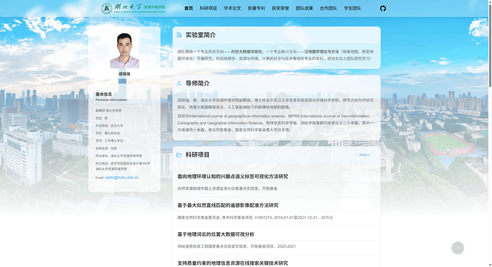
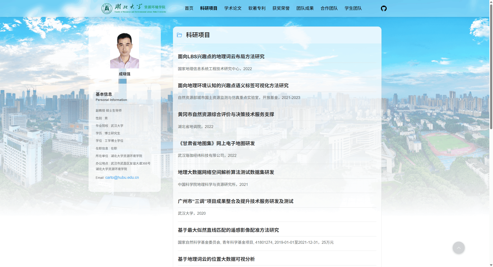
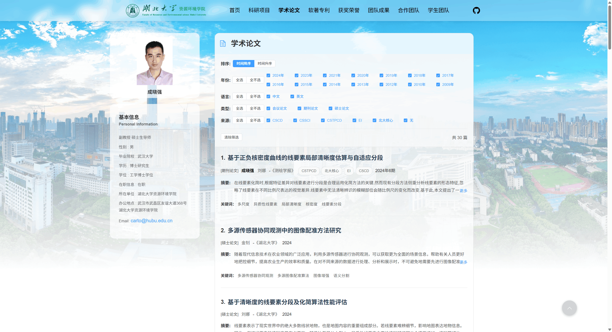
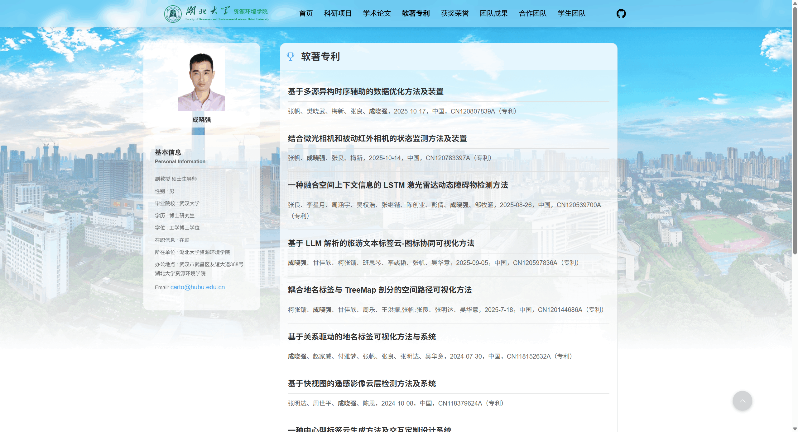
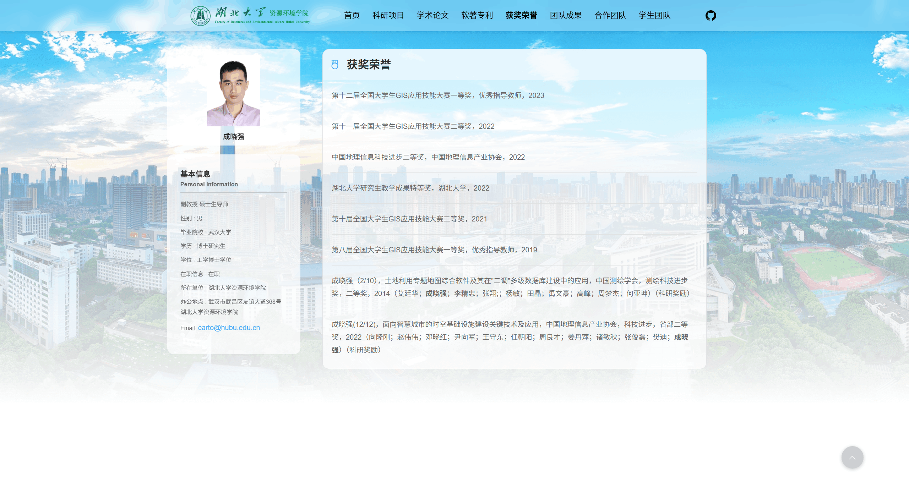
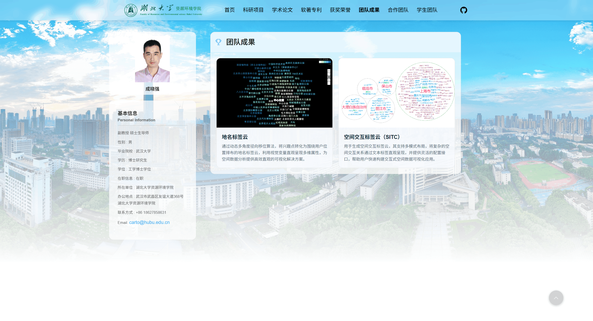

## 湖北大学制图组官网

这是 **湖北大学制图组官网** 的前端项目，基于 **Vue 3 + Element Plus + Vite** 搭建，通过 Markdown 文件驱动内容，便于非开发人员维护实验室官网信息（成员、项目、论文、荣誉等）。

---

## 特性

- **组件化开发**：使用 Vue 3 组合式 API 构建，可维护性高。
- **Element Plus UI**：统一的组件库，视觉风格一致。
- **Markdown 内容驱动**：大部分页面内容来自 `public/content/` 下的 Markdown 文件，编辑方便。
- **多栏目展示**：支持个人/团队介绍、科研项目、论文成果、软著专利、团队荣誉等栏目。
- **快速构建与预览**：基于 Vite，开发、构建与本地预览体验流畅。

---

## 技术栈

- Vue 3
- Element Plus
- Vue Router
- Vite
- Marked（用于渲染 Markdown 文件）

---

## 项目结构

```text
hubuCartographicGroup/
├── public/
│   ├── content/                  # Markdown 内容文件
│   │   ├── personal-info.md
│   │   ├── lab-introduction.md
│   │   ├── mentor-introduction.md
│   │   ├── projects.md
│   │   ├── projects-preview.md
│   │   ├── papers.md
│   │   ├── papers-preview.md
│   │   ├── softwriting-patent.md
│   │   ├── softwriting-patent-preview.md
│   │   ├── honour.md
│   │   ├── honour-preview.md
│   │   ├── cooperation-team.md
│   │   ├── student-team.md
│   │   └── team-achievements*.md
│   └── img/                      # 图片资源
│       ├── hubu-logo.png
│       ├── hubu.jpg
│       ├── hubu2.png
│       ├── chengxiaoqiang.png
│       ├── 地名标签云.png
│       └── 空间交互标签云.png
├── src/
│   ├── components/
│   │   ├── MarkdownContent.vue   # Markdown 渲染组件
│   │   ├── PapersContent.vue     # 论文列表内容组件
│   │   └── pages/                # 各个页面组件
│   │       ├── HomePage.vue
│   │       ├── ProjectsPage.vue
│   │       ├── PapersPage.vue
│   │       ├── SoftwritingPatentPage.vue
│   │       ├── StudentTeamPage.vue
│   │       ├── TeamAchievementsPage.vue
│   │       └── CooperationTeamPage.vue
│   ├── views/
│   │   └── Home.vue              # 主视图入口
│   ├── router/
│   │   └── index.js              # 路由配置
│   ├── App.vue
│   └── main.js
├── index.html
├── package.json
└── vite.config.js
```

---

## 环境要求

- Node.js ≥ 18（建议保持在长期支持 LTS 版本）
- npm ≥ 9 或兼容的包管理工具（如 pnpm / yarn，可自行替换命令）

---

## 安装依赖

在项目根目录执行：

```bash
npm install
```

---

## 本地开发

```bash
npm run dev
```

运行后根据控制台输出访问本地开发地址（通常为 `http://localhost:5173/`）。

---

## 构建与预览

**构建生产包：**

```bash
npm run build
```

构建完成后会生成 `dist/` 目录。

**本地预览生产包：**

```bash
npm run preview
```

---

## 内容管理（Markdown）

所有主要页面内容都存储在 `public/content/` 目录下的 Markdown 文件中。每个页面组件对应一个或多个 Markdown 文件：

- `personal-info.md`：个人信息
- `lab-introduction.md`：实验室简介
- `mentor-introduction.md`：导师简介
- `projects.md` / `projects-preview.md`：科研项目（完整列表 & 首页预览）
- `papers.md` / `papers-preview.md`：学术论文（完整列表 & 首页预览）
- `softwriting-patent.md` / `softwriting-patent-preview.md`：软著专利
- `honour.md` / `honour-preview.md`：获奖荣誉
- `cooperation-team.md`：合作团队
- `student-team.md`：学生团队
- `team-achievements.md` / `team-achievements-preview.md`：团队成果及预览

**修改内容时：**

1. 找到对应的 Markdown 文件（例如修改论文列表时，编辑 `public/content/papers.md`）。
2. 使用任意文本编辑器或 Markdown 编辑器修改内容。
3. 保存后，在开发模式下页面会自动热更新，无需修改前端代码。

**新增一个栏目的大致步骤（示例）：**

1. 在 `public/content/` 下新增一个 `.md` 文件，例如 `new-section.md`。
2. 在 `src/components/pages/` 中新增对应的页面组件，例如 `NewSectionPage.vue`，内部通过 `MarkdownContent.vue` 读取该 Markdown。
3. 在 `src/router/index.js` 中增加新路由指向该页面组件。

---

## 部署效果

- **首页：**

  

- **科研项目：**

  

- **学术论文：**

  

- **软著专利：**

  

- **获奖荣誉：**

  

- **团队成果：**

  

---

## 部署建议

构建生成的 `dist/` 目录为纯静态资源，可部署到任意静态网站托管服务，例如：

- 学校/实验室 Web 服务器（Nginx/Apache 等）
- GitHub Pages / Gitee Pages
- 各类对象存储静态网站托管（如 OSS、COS 等）

部署时只需将 `dist/` 目录内容上传至服务器指定目录，并确保根路径配置与项目路由设置一致。
